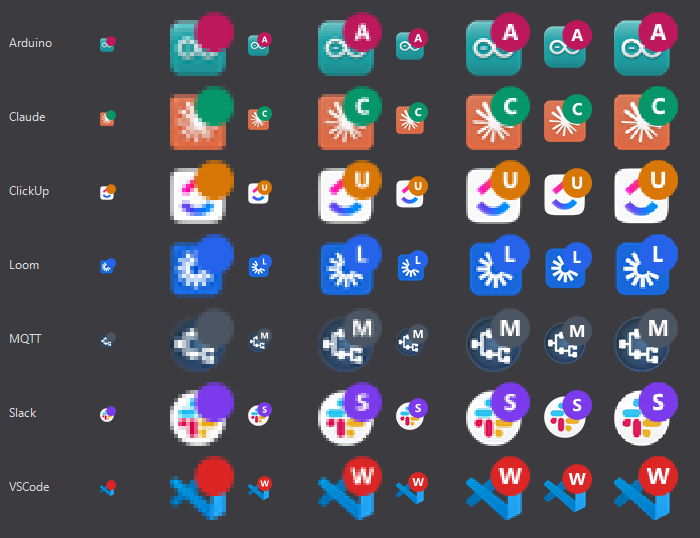
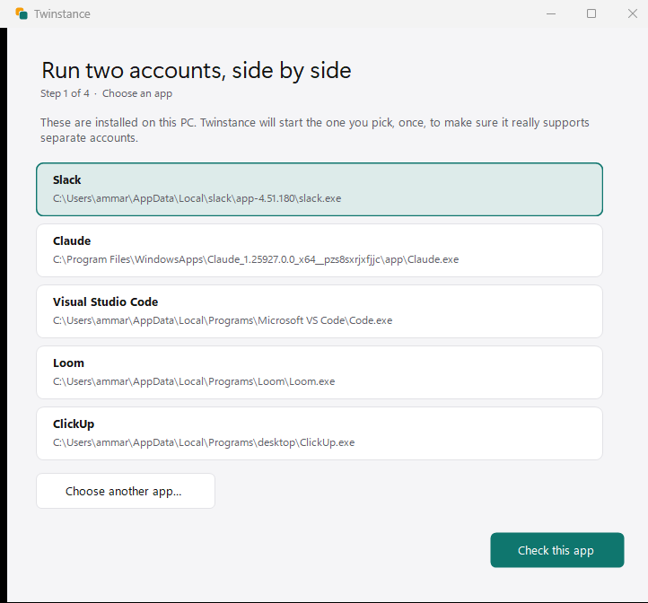
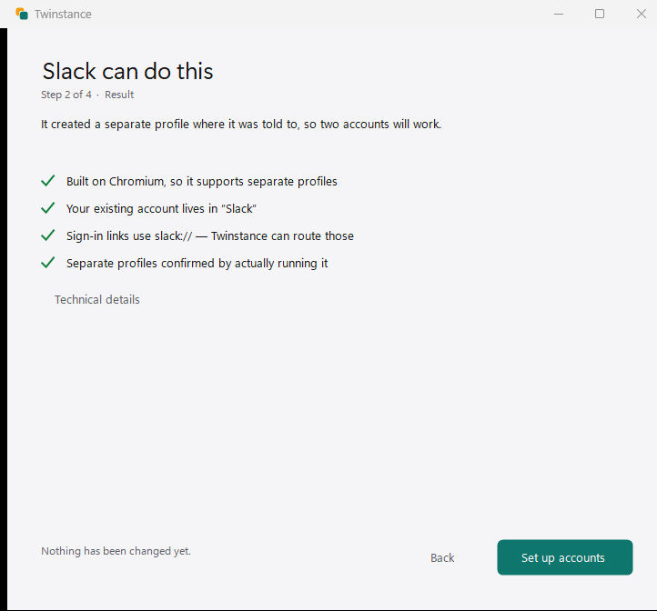
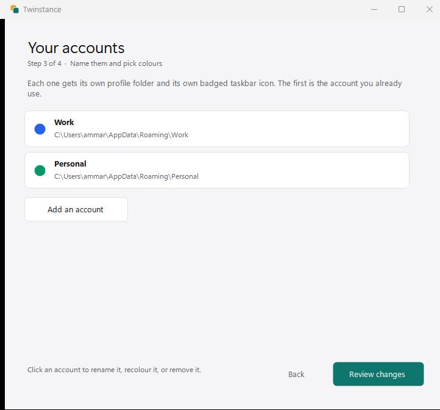
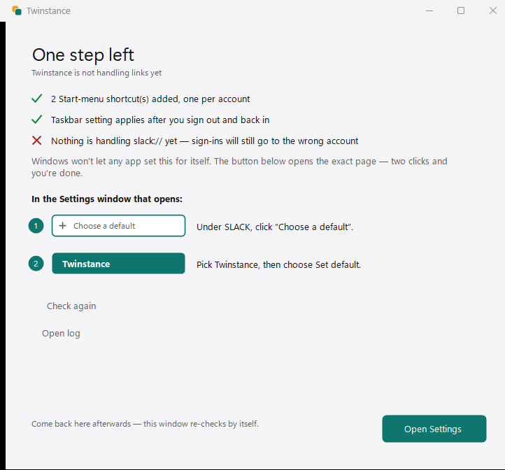

<div align="center">


# Twinstance

**Use two accounts of the same app at the same time on Windows** — and have the sign-in
actually land on the one you meant.

Slack · Discord · VS Code · Claude · Notion · Obsidian · Figma · and most other desktop apps

</div>

---

## Is this for you?

You have two accounts for the same app — work and personal, two clients, two organisations —
and Windows only lets you be signed into one at a time. So you sign out, sign in, sign out
again, all day.

Twinstance gives each account its own copy of the app, running side by side, with a coloured
badge on each so you can tell them apart at a glance.

<div align="center">

</div>

**It also fixes the part that makes this hard.** Signing in opens your browser, and when the
browser hands you back, Windows always returns you to the *first* copy — so the second account
can never finish signing in. Twinstance catches that hand-off and sends it to the window you
started from.

---

## Getting started

### 1 — Download

Grab **one file** from the [**Releases page**](../../releases):

| Download this | Size | If |
|---|---|---|
| **`Twinstance-standalone.exe`** | ~147 MB | you want it to just work — **pick this one if unsure** |
| `Twinstance.exe` | ~0.6 MB | you already have the [.NET 8 Desktop Runtime](https://dotnet.microsoft.com/download/dotnet/8.0) |

There is nothing to unzip. It is one file.

### 2 — Run it

Double-click it. Windows will probably say **"Windows protected your PC"** — this is expected,
and it is not a sign that anything is wrong. It happens to every program that hasn't paid for a
code-signing certificate yet, and Twinstance hasn't.

> Click **More info**, then **Run anyway**.

If you would rather not take that on trust, you can check the file against the published
checksums or build it yourself — both are explained in [SECURITY.md](SECURITY.md).

Twinstance then offers to install itself into your own user folder. Say yes. There is no
administrator prompt and nothing is written outside your profile.

### 3 — Pick your app



It lists the apps it found on your PC. Click one, then **Check this app**.

A window from that app will open and close by itself — that is Twinstance making sure the app
really supports separate accounts, rather than promising something it can't deliver.



### 4 — Add your second account



Your existing account is already there. Click **Add an account**, give it a name like
*Personal*, and pick a colour — or use your own photo, like Chrome profiles.

### 5 — Apply, and do the one step Windows insists on

Twinstance shows you everything it is about to change, then does it.

The very last step has to be you: **Windows does not allow any program to make itself the
handler for sign-in links.** Twinstance opens the exact Settings page and shows you the two
clicks to make.



That is it. Open your second account from the Start menu and sign in as normal.

---

## Everyday use

- **Open an account** — Start menu, or the desktop shortcuts, one per account.
- **Tell them apart** — each taskbar icon carries its account's colour.
- **Sign in** — start it from the window you want it to land in, and don't click the other one
  while your browser is working. That is the one rule.

### Removing it

**Settings → Apps → Installed apps → Twinstance → Uninstall**, like any other program.

Your accounts and everything you're signed into are **not** deleted. Twinstance shows you where
those folders are so you can remove them yourself if you want to.

---

## Questions people ask

<details>
<summary><b>Is my data safe? Does this see my passwords?</b></summary>

No. Twinstance never sees your password, and it has **no network code at all** — it cannot send
anything anywhere.

When you sign in, your browser does that with the app's own servers exactly as it always has.
Twinstance's only job is deciding *which window* the browser hands back to. Sign-in links are
recorded in a local log with the sensitive part stripped out before it is ever written to disk.

[SECURITY.md](SECURITY.md) explains all of it in detail.
</details>

<details>
<summary><b>Why did my antivirus complain?</b></summary>

Because Twinstance does several things that look, from the outside, like something suspicious:
it handles sign-in links, it reads which programs are running, and it changes taskbar icons.
Those are the product, but a scanner can only see the shape.

We won't tell you to switch your antivirus off. [SECURITY.md](SECURITY.md) explains exactly
what it does and what your sensible options are.
</details>

<details>
<summary><b>Will this get me banned, or break the app?</b></summary>

It doesn't modify the app. It starts the app's own official copy with a setting the app already
supports — the same one Chrome uses for profiles. Each account keeps its own folder, and the app
itself has no idea Twinstance exists.
</details>

<details>
<summary><b>My app isn't in the list.</b></summary>

Use **Choose another app…** and point it at the program's `.exe`. The list is only a shortcut —
apps that aren't on it work exactly the same way. Twinstance checks any app you give it and tells
you honestly if it won't work.
</details>

<details>
<summary><b>Can I use three accounts? Four?</b></summary>

Yes. Add as many as you like; each gets its own colour and shortcut.
</details>

<details>
<summary><b>Does it start with Windows / slow my PC down?</b></summary>

A small background task keeps the badges on your taskbar icons, because Windows and the apps
themselves keep clearing them. It uses about **0.4% of one CPU core**. It's listed in Task
Manager → Startup apps, where you can turn it off if you'd rather.
</details>

<details>
<summary><b>What doesn't work?</b></summary>

- **Sign-in routing is a good guess, not magic.** It sends the link to the window you used most
  recently. Start the sign-in, then leave the other window alone until it finishes.
- **Microsoft Teams (new)** can't be supported — it isn't built the way the others are.
  Twinstance detects that and tells you rather than half-working.
- **Some Microsoft Store apps** refuse to be started with settings at all. Twinstance says so
  instead of blaming the app.
</details>

---

## For developers

Detection is fully automatic: point it at any executable and it works out whether the app is
Chromium/Electron, where its profiles live, which URL scheme it owns, and — by actually running
it once — whether it honours separate profiles at all. No per-app tables.

```bash
dotnet build Twinstance.sln -c Release
dotnet run --project src/Twinstance.Tests -c Release --no-build   # exit code is the result
pwsh -File scripts/publish.ps1                                   # single-file releases
```

| Document | What's in it |
|---|---|
| [ARCHITECTURE.md](docs/ARCHITECTURE.md) | how it works, and the repository layout |
| [DETECTION.md](docs/DETECTION.md) | the six-step method for identifying a target app |
| [BUILDING.md](docs/BUILDING.md) | build, test, and an honest verification status |
| [SECURITY.md](SECURITY.md) | what it touches, how sign-in links are handled, threat model |
| [ENGINEERING.md](ENGINEERING.md) | the decisions that look arbitrary but aren't — **read before contributing** |

Two rules matter most:

- `Twinstance.Core` targets `net8.0`, not `net8.0-windows`, so an OS call there **fails to
  compile**. Decisions live there and are unit-tested; `Twinstance.Platform` only observes.
- Path matching is on exact normalised paths, never substrings. `work` and `work2` must stay
  distinct, and there's a regression test named after it.

Contributions welcome — especially confirmations that a given app works, since the preset list
marks entries as `measured` or `inferred` and most are still inferred.

## Licence

[MIT](LICENSE) — free to use, change and share.

## Trademarks

Twinstance is not affiliated with, endorsed by, or sponsored by Anthropic, Slack Technologies,
Discord, Microsoft, Signal, or any other application vendor. Product names are trademarks of
their respective owners and are used only to describe compatibility.

**No third-party artwork ships with Twinstance.** Badged icons are composed at run time from the
copy of the application already installed on your machine.
